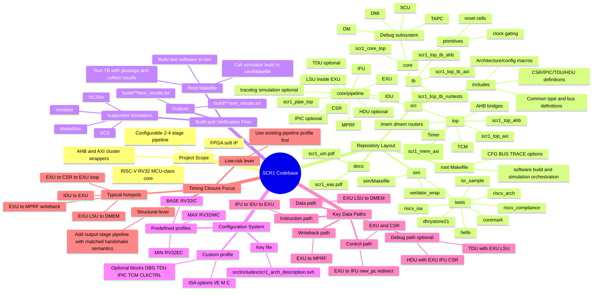

# SCR1 Codebase Mind Map

> Render this file in any Markdown viewer with Mermaid support.

```mermaid
mindmap
  root((SCR1 Codebase))
    Project Scope
      FPGA soft IP
      RISC-V RV32 MCU-class core
      Configurable 2-4 stage pipeline
      AHB and AXI cluster wrappers
    Repository Layout
      src
        includes
          Architecture/config macros
          Common type and bus definitions
          CSR/IPIC/TDU/HDU definitions
        core
          scr1_core_top
          Debug subsystem
            SCU
            DM
            DMI
            TAPC
          primitives
            reset cells
            clock gating
        core/pipeline
          scr1_pipe_top
          IFU
          IDU
          EXU
          LSU inside EXU
          MPRF
          CSR
          IPIC optional
          TDU optional
          HDU optional
          tracelog simulation optional
        top
          scr1_top_ahb
          scr1_top_axi
          imem dmem routers
          AHB bridges
          AXI bridge (scr1_mem_axi)
          TCM
          Timer
        tb
          scr1_top_tb_ahb
          scr1_top_tb_axi
          scr1_top_tb_runtests
      sim
        sim/Makefile
        verilator_wrap
        tests
          hello
          isr_sample
          riscv_isa
          riscv_arch
          riscv_compliance
          dhrystone21
          coremark
      docs
        scr1_um.pdf
        scr1_eas.pdf
      root Makefile
        CFG BUS TRACE options
        software build and simulation orchestration
    Build and Verification Flow
      Root Makefile
        Build test software to hex
        Call simulator build in sim/Makefile
        Run TB with plusargs and collect results
      Supported simulators
        Verilator
        VCS
        ModelSim
        NCSim
      Outputs
        build/**/sim_results.txt
        build/**/test_results.txt
    Configuration System
      Predefined profiles
        MAX RV32IMC
        BASE RV32IC
        MIN RV32EC
      Custom profile
        ISA options I/E M C
        Optional blocks DBG TDU IPIC TCM CLKCTRL
      Key file
        src/includes/scr1_arch_description.svh
    Key Data Paths
      Instruction path
        IFU to IDU to EXU
      Data path
        EXU LSU to DMEM
      Writeback path
        EXU to MPRF
      Control path
        EXU and CSR
        EXU to IFU new_pc redirect
      Debug path optional
        HDU with EXU IFU CSR
        TDU with EXU LSU
    Timing Closure Focus
      Typical hotspots
        IDU to EXU
        EXU LSU to DMEM
        EXU to CSR to EXU loop
        EXU to MPRF writeback
      Low-risk lever
        Use existing pipeline profile first
      Structural lever
        Add output-stage pipeline with matched handshake semantics
```

